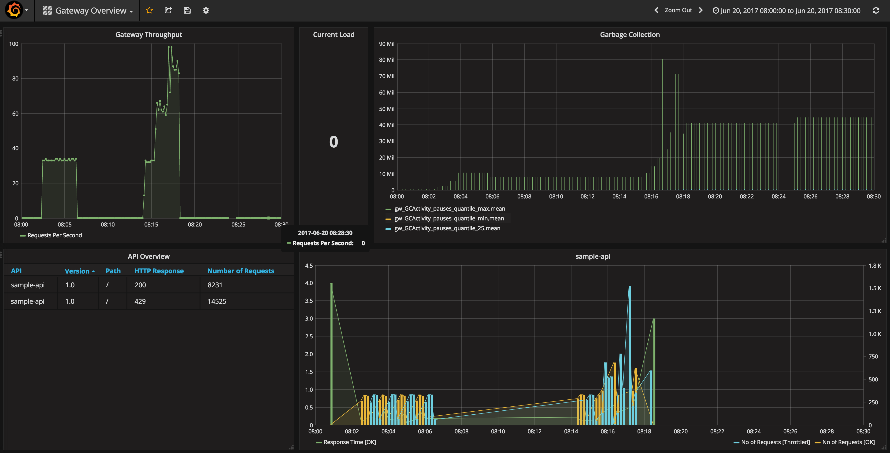
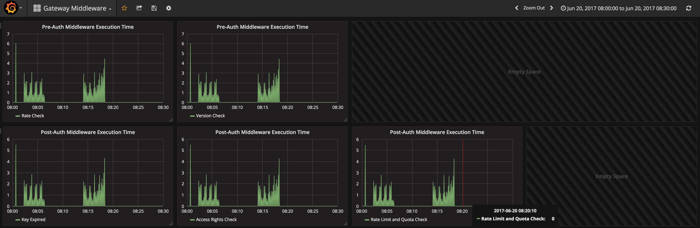

# Tyk Professional Installation on Kubernetes
This guide details how to install a Tyk Professional installation on a `minikube` Kubernetes installation. It also shows how a Grafana dashboard can be used to configured to provide detailed monitoring of the environment.


<sup>Grafana Overview Dashboard</sup><br><br>

<sup>Grafana Middleware Dashboard</sup>

## Getting Started

### Prerequisites
* [minikube](https://kubernetes.io/docs/getting-started-guides/minikube/)
* [kubectl](https://kubernetes.io/docs/tasks/tools/install-kubectl/)


### Install
See [https://nextmetaphor.io/2017/01/19/local-kubernetes-on-macos/](https://nextmetaphor.io/2017/01/19/local-kubernetes-on-macos/) for details on how to install the prerequisite software onto macOS.

The current date and time on `minikube` containers often falls behind the actual date and time. Use the following command to rectify that; for more details see [https://github.com/kubernetes/minikube/issues/1378](https://github.com/kubernetes/minikube/issues/1378).

```bash
minikube ssh -- docker run -i --rm --privileged --pid=host debian nsenter -t 1 -m -u -n -i date -u $(date -u +%m%d%H%M%Y)
```

## Deployment 
#### 01. Install InfluxDB
[InfluxDB](https://github.com/influxdata/influxdb) is an open-source time series database that we will use to store the metrics from Tyk. 
```bash
kubectl create configmap influxdb-conf --from-file=influxdb/influxdb.conf
kubectl create -f influxdb/influxdb-deployment.yaml
kubectl create -f influxdb/influxdb-service.yaml
```

We can verify that this has been deployed successfully by executing the following command which will allow us to log into the database.
```bash
open http://`minikube ip`:30101
```

Note that 
* the Port should be set to `30100`
* the Username should be set to `admin`
* the Password should be set to `admin`

Create an analytics databases for Tyk.
```bash
CREATE DATABASE "tyk_analytics"
```


#### 02. Install Telegraf
[Telegraf](https://github.com/influxdata/telegraf) is an open-source metrics collection daemon that we will use to collect metrics from Tyk and then store in InfluxDB.
```bash
kubectl create configmap telegraf-conf --from-file=telegraf/telegraf.conf
kubectl create -f telegraf/telegraf-deployment.yaml
kubectl create -f telegraf/telegraf-service.yaml
```

#### 03. Install Grafana
[Grafana](https://github.com/grafana/grafana) is an open-source metrics dashboard that we will use to visualise the data stored in InfluxDB.
```bash
kubectl create -f grafana/grafana-deployment.yaml
kubectl create -f grafana/grafana-service.yaml
```

We can verify that this has been deployed successfully by executing the following command which will allow us open the Grafana dashboard and connect to the InfluxDB database.
```bash
open http://`minikube ip`:30103
```
Note that
* the Username should be set to `admin`
* the Password should be set to `admin`

Once logged in, create a data source with the following options:
* the **Name** should be set to `Gateway`
* the **Type** should be set to `InfluxDB`

Within the **Http settings** section:
* the **Url** should be set to `http://influxdb:8086`
* **Access** should be set to `Proxy`

Leave everything unchecked in the **Http Auth** section.

Within the **InfluxDB Details** section:
* the **Database** should be set to `telegraf`
* the **User** should be set to `admin`
* the **Password** should be set to `admin`

Create another datasource with the above values, changing:
* the **Name** should be set to `tyk_analytics`
* the **Database** should be set to `tyk_analytics`

#### 04. Install Mongo
Install the Mongo database which stores the Tyk API definitions and long-term analytics information.

```bash
kubectl create -f mongo/mongo-deployment.yaml
kubectl create -f mongo/mongo-service.yaml
```

#### 05. Install Redis
Install the Redis distributed in-memory cache which stores the active API keys and short-term analytics information.

```bash
kubectl create -f redis/redis-deployment.yaml
kubectl create -f redis/redis-service.yaml
```

#### 06. Install Tyk Dashboard
Install the Tyk Dashboard which allow us to administer the API gateway environment.
```bash
kubectl create configmap tyk-dashboard-conf --from-file=tyk-dashboard/tyk_analytics.conf
kubectl create -f tyk-dashboard/tyk-dashboard-deployment.yaml
kubectl create -f tyk-dashboard/tyk-dashboard-service.yaml
```

#### 07. Install Tyk Gateway
Install the Tyk Gateway nodes themselves.
```bash
kubectl create configmap tyk-gateway-conf --from-file=tyk-gateway/tyk.conf
kubectl create -f tyk-gateway/tyk-gateway-deployment.yaml
kubectl create -f tyk-gateway/tyk-gateway-service.yaml
```

#### 08. Install Tyk Pump
Install the Tyk Pump which extracts analytic data from Redis.
```bash
kubectl create configmap tyk-pump-conf --from-file=tyk-pump/pump.conf
kubectl create -f tyk-pump/tyk-pump-deployment.yaml
```

#### 09. Install A Sample API
Install a sample API that we can use to test the gateway.
```bash
kubectl create -f sample-api/sample-api-deployment.yaml
kubectl create -f sample-api/sample-api-service.yaml
```

#### 10. Install An nginx Server
Install a nginx server which can host the grpc package definitions.
```bash
kubectl create -f nginx/nginx-deployment.yaml
kubectl create -f nginx/nginx-service.yaml
```

## Validation

#### Open the Tyk Dashboard
Execute the following commands to log into the Tyk Dashboard:
```bash
./init.sh

open http://`minikube ip`:30001
```
At the login screen:
* the **Username** should be set to `admin@test.com`
* the **Password** should be set to `admin123`


#### Deploy an API and Create A Key
```bash
# Set the for the Tyk user doing the deployment
export AUTHORIZATION=

curl http://`minikube ip`:30001/api/apis/ -X POST -d @sample-api/api-definition.json --header "Content-Type: application/json" --header "Authorization: $AUTHORIZATION"

# Set the API ID in the sample-api/token-definition.json file
curl http://`minikube ip`:30001/api/keys -X POST -d @sample-api/token-definition.json --header "Content-Type: application/json" --header "Authorization: $AUTHORIZATION"

# Set for the key just created
export KEY_ID=
curl http://`minikube ip`:30002/sample-api/ --header "x-api-version: 1.0" --header "Authorization: $KEY_ID"
```

#### View the Statistics in Grafana
```bash
open http://`minikube ip`:30103
```

#### Performance Test Using Gatling
To performance test, create a gatling deployment, passing in the simulation file. 
```bash
# First edit the gatling/user-files/SampleAPISimulation file and set the API key
kubectl create -f gatling/gatling-deployment.yaml
```

This will run constantly and will need killing by removing the Kubernetes deployment.
```bash
kubectl delete -f gatling/gatling-deployment.yaml
```

#### Patch the Dashboard
To change the version of the dashboard, simply deploy an alternative version and update the service selector.
```bash
# Create an update deployment
kubectl create -f tyk-dashboard/tyk-dashboard-deployment-v1.3.2.yaml

# Patch the service to point at it
kubectl patch -f tyk-dashboard/tyk-dashboard-service.yaml -p '{"spec": {"selector": {"version": "v1.3.2"}}}'

open http://`minikube ip`:30001
```

To revert back, simply change the selector again.

```bash
# Patch the service to point at it
kubectl patch -f tyk-dashboard/tyk-dashboard-service.yaml -p '{"spec": {"selector": {"version": "latest"}}}'
kubectl delete -f tyk-dashboard/tyk-dashboard-deployment-v1.3.2.yaml

open http://`minikube ip`:30001
```

## Uninstalling
To completely remove all of the configuration, deployments and services from `minikube`, execute the following:
```bash
# Delete nginx
kubectl delete -f nginx/nginx-service.yaml
kubectl delete -f nginx/nginx-deployment.yaml

# Delete gatling
kubectl delete -f gatling/gatling-deployment.yaml

# Delete sample-api
kubectl delete -f sample-api/sample-api-service.yaml
kubectl delete -f sample-api/sample-api-deployment.yaml

# Delete tyk-pump
kubectl delete -f tyk-pump/tyk-pump-deployment.yaml
kubectl delete configmap tyk-pump-conf

# Delete tyk-gateway
kubectl delete -f tyk-gateway/tyk-gateway-service.yaml
kubectl delete -f tyk-gateway/tyk-gateway-deployment.yaml
kubectl delete configmap tyk-gateway-conf

# Delete tyk-dashboard
kubectl delete -f tyk-dashboard/tyk-dashboard-service.yaml
kubectl delete -f tyk-dashboard/tyk-dashboard-deployment.yaml
kubectl delete -f tyk-dashboard/tyk-dashboard-deployment-v1.3.1.yaml
kubectl delete -f tyk-dashboard/tyk-dashboard-deployment-v1.3.2.yaml
kubectl delete configmap tyk-dashboard-conf 

# Delete redis
kubectl delete -f redis/redis-service.yaml
kubectl delete -f redis/redis-deployment.yaml

# Delete mongo
kubectl delete -f mongo/mongo-service.yaml
kubectl delete -f mongo/mongo-deployment.yaml

# Delete grafana
kubectl delete -f grafana/grafana-service.yaml
kubectl delete -f grafana/grafana-deployment.yaml

# Delete telegraf
kubectl delete -f telegraf/telegraf-service.yaml
kubectl delete -f telegraf/telegraf-deployment.yaml
kubectl delete configmap telegraf-conf

# Delete influxdb
kubectl delete -f influxdb/influxdb-service.yaml
kubectl delete -f influxdb/influxdb-deployment.yaml
kubectl delete configmap influxdb-conf
```